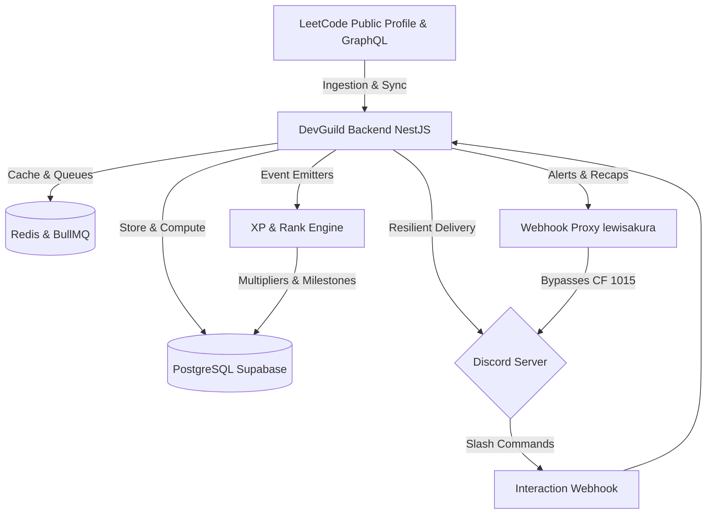
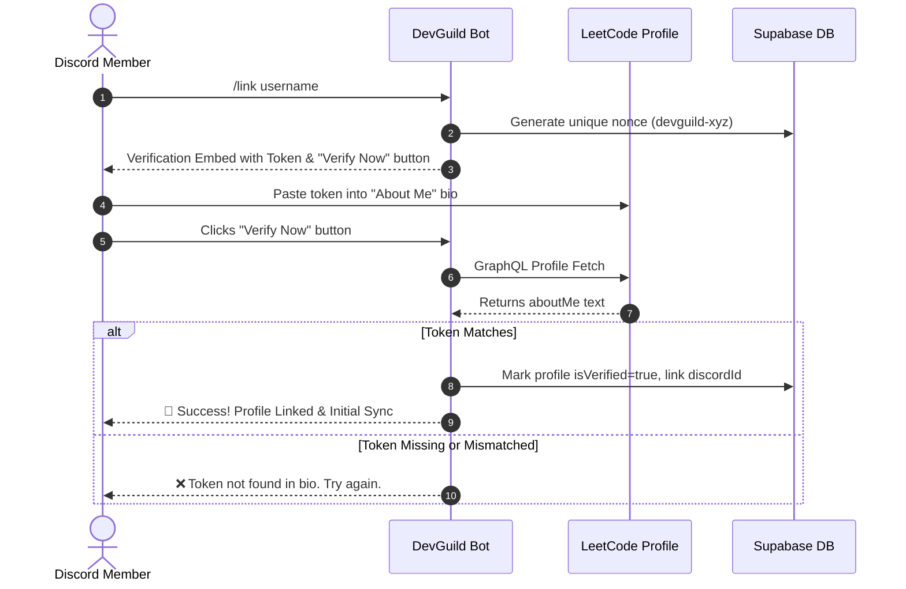
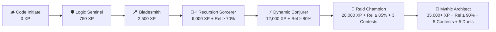
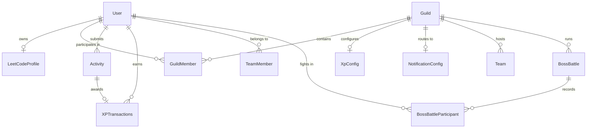

# ⚔️ DevGuild — Complete Features & System Architecture Guide

> **Official Comprehensive System Specification & Feature Guide**  
> *DevGuild: Enterprise-grade, Discord-native LeetCode Gamification, Accountability & Community Operating System.*

---

## 📑 Table of Contents

1. [Executive Overview & Vision](#1-executive-overview--vision)
2. [Discord Architecture & Resilient Delivery](#2-discord-architecture--resilient-delivery)
3. [Account Linking & Verification Protocol](#3-account-linking--verification-protocol)
4. [Live Sync & Ingestion Engine](#4-live-sync--ingestion-engine)
5. [XP Economy & Lecture-Friendly Anti-Farming](#5-xp-economy--lecture-friendly-anti-farming)
6. [Daily Streaks & Milestone Rewards](#6-daily-streaks--milestone-rewards)
7. [Theme C: RPG Fantasy Guild Hierarchy](#7-theme-c-rpg-fantasy-guild-hierarchy)
8. [Reliability & Consistency Score Engine](#8-reliability--consistency-score-engine)
9. [Boss Battles & Official LeetCode Contest Raids](#9-boss-battles--official-leetcode-contest-raids)
10. [Challenges, Duels & Permanent Squads](#10-challenges-duels--permanent-squads)
11. [Leaderboards, Analytics & Automated Recaps](#11-leaderboards-analytics--automated-recaps)
12. [Complete Slash Command Directory](#12-complete-slash-command-directory)
13. [Database Entity-Relationship Architecture](#13-database-entity-relationship-architecture)
14. [Deployment, Infrastructure & Resilience](#14-deployment-infrastructure--resilience)

---

## 1. Executive Overview & Vision

**DevGuild** turns daily competitive programming practice into an interactive, gamified Discord RPG. Rather than functioning as a passive stat tracker, DevGuild builds a vibrant community of coders focused on:

- **Consistency Over Intensity**: Celebrating daily habits and progressive skill acquisition rather than sporadic cramming.
- **Fair Gamification**: Transparent XP, anti-farming curves that respect lecture problem-solving, and multi-factor RPG rank tiers.
- **Cooperative & Competitive Play**: Server-wide Boss Raids during official LeetCode contests, squad formation, 1v1/2v2 duels, and seasonal leaderboards.
- **Zero-Friction Discord UX**: Instant synchronous slash command responses, role notifications (`@DEV`), rich visual embeds, and rock-solid delivery infrastructure.

---

## 2. Discord Architecture & Resilient Delivery

DevGuild utilizes a dual-path communication model engineered for sub-second response times and 99.9% uptime, immune to Cloudflare IP rate-limits on shared cloud providers (such as Render).

### Dual-Path Discord Integration
1. **Discord Gateway Client (`discord.js v14`)**:
   - Maintains a persistent WebSocket connection to the Discord Gateway.
   - Manages role lookups, member caching, and direct channel dispatch when active.
2. **Synchronous HTTP Interaction Endpoint (`/interactions`)**:
   - Cryptographically verifies inbound interaction requests using **Ed25519** public key cryptography.
   - Returns instantaneous synchronous HTTP 200 responses to Discord, eliminating outbound network hops for command execution and bypassing Gateway disconnects.

### Tri-Tier Resilient Channel Delivery
When broadcasting automated alerts (problem solves, daily recaps, raid announcements), `DiscordService.sendMessageToChannel` uses a three-tier fallback mechanism:
1. **Tier 1 (Gateway)**: If the WebSocket gateway client is healthy and connected, dispatches via `channel.send()`.
2. **Tier 2 (Proxied Discord Webhooks)**: If gateway egress is blocked or rate-limited, resolves the webhook URL (checking `DISCORD_ALERT_WEBHOOK_URL` in environment variables or dynamically querying `NotificationConfig.webhookUrl` from Supabase) and delivers through a dedicated proxy host (`webhook.lewisakura.moe`). This completely bypasses Cloudflare Error 1015 IP blocking on Render.
3. **Tier 3 (Direct REST POST)**: Native IPv4 HTTPS POST request directly to `discord.com/api/v10/channels/:id/messages` as a final fallback.

---

## 3. Account Linking & Verification Protocol

DevGuild requires cryptographic ownership proof before associating a Discord user with a LeetCode handle.

### Protocol Steps:
1. User runs `/link <username>`.
2. The bot generates an ephemeral verification embed containing a unique verification token (`devguild-<nonce>`) with a 15-minute expiration.
3. The user pastes the token into their **"About Me"** bio on [LeetCode Profile Settings](https://leetcode.com/profile/).
4. The user clicks the interactive **"Verify Now"** button.
5. DevGuild fetches the user's public profile via LeetCode's GraphQL endpoint. Once verified, the database sets `isVerified = true` and binds the user's unique Discord snowflake to the LeetCode profile.
6. **Security Invariant**: Strictly enforces a 1:1 mapping — one Discord account per LeetCode profile, and vice versa.
7. Profile can be detached at any time using `/unlink`.

---

## 4. Live Sync & Ingestion Engine

### Ingestion Flow:
1. **Trigger**: Triggered via `/sync` slash command, automated BullMQ cron schedule, or manual sync trigger.
2. **GraphQL Query**: Pulls the 20 most recent accepted submissions (`recentAcSubmissionList`) from LeetCode.
3. **Idempotency & Deduplication**: Each submission is checked against `(userId, leetCodeSubmissionId)`. Existing records are safely skipped with zero duplicate XP or alerts.
4. **Topic Classification**: Matches submission topic tags against an internal classification dictionary:
   - `ARRAYS`, `STRINGS`, `TREES`, `GRAPHS`, `DYNAMIC_PROGRAMMING`, `MATH`, `OTHER`.
5. **Atomic XP & Activity Transaction**: Creates the `Activity` record, updates user streak counters, computes XP, awards milestone bonuses, and updates guild cumulative points in a single database transaction.
6. **Downstream Event Broadcast**: Emits `activity.created` event via NestJS `EventEmitter2` for real-time Discord notifications and achievement evaluation.

---

## 5. XP Economy & Lecture-Friendly Anti-Farming

DevGuild features a rebalanced, motivating economy that rewards consistency while preventing trivial leaderboard manipulation.

### Base XP Rewards
| Difficulty | Base XP | Philosophy |
| :--- | :---: | :--- |
| 🟩 **Easy** | **25 XP** | Accessible entry point; foundations & daily consistency. |
| 🟨 **Medium** | **60 XP** | Core interview standard; algorithmic depth. |
| 🟥 **Hard** | **150 XP** | Mastery; complex dynamic programming, graphs & advanced algorithms. |

### Lecture-Friendly Anti-Farming Guardrails
To accommodate students solving multiple easy problems during class, bootcamps, or video courses, the anti-farming curve is relaxed:

$$\text{Diminishing Factor} = \begin{cases} 
1.00 & \text{if Easy solves in 24h} \le 10 \\
0.80 & \text{if } 11 \le \text{Easy solves in 24h} \le 20 \\
0.50 & \text{if Easy solves in 24h} > 20 \text{ (Floor)}
\end{cases}$$

- **1 to 10 Easy Solves/Day**: **100% full XP** (zero penalty for coursework).
- **11 to 20 Easy Solves/Day**: **80% XP** (gentle tapering).
- **21+ Easy Solves/Day**: **50% XP floor** (prevents automated bot scripting from destroying the economy).
- **Immunity**: Medium and Hard problems are **never diminished** under any circumstance.

### Streak Bonus Multiplier
Maintaining an active consecutive streak increases the XP earned on every solve:

$$\text{Streak Multiplier} = 1.0 + \min(\text{Current Streak Days} \times 0.02, 0.50)$$

- **Rate**: $+2\%$ bonus XP per consecutive active day.
- **Cap**: $+50\%$ maximum bonus multiplier ($1.50\times$).

---

## 6. Daily Streaks & Milestone Rewards

### Strict Calendar Synchronization
DevGuild enforces **calendar consistency** directly aligned with the official LeetCode streak tracking calendar. No artificial shields or streak-saver tokens are applied, ensuring that the bot's displayed streak matches the user's official LeetCode profile at all times.

### Milestone XP Bursts
When a coder reaches a milestone, `ActivityService` detects the transition and automatically issues an instant bonus `STREAK_BONUS` transaction:

| Streak Milestone | Bonus XP | Recognition |
| :---: | :---: | :--- |
| **7 Days** | **+100 XP** | 1 Week of uninterrupted dedication |
| **14 Days** | **+250 XP** | Fortnight warrior |
| **30 Days** | **+600 XP** | 1 Month consistency champion |
| **60 Days** | **+1,500 XP** | 2 Months habitual coding |
| **90 Days** | **+2,500 XP** | Season-long coding veteran |
| **180 Days** | **+5,000 XP** | Half-year algorithmic titan |
| **365 Days** | 🌟 **+12,000 XP** | Full Year Mythic Legend |

---

## 7. Theme C: RPG Fantasy Guild Hierarchy

Guild members advance through a 7-tier RPG ladder reflecting real skill, dedication, and reliability. High tiers require not just raw XP, but proven reliability, contest participation, and duel victories.

### Complete Tier Ladder Specifications
| Tier | Title & Emoji | XP Required | Additional Requirements |
| :--- | :--- | :---: | :--- |
| `BRONZE` | 🪵 **Code Initiate** | `0 – 749 XP` | Default entry tier for all guild newcomers. |
| `SILVER` | 🛡️ **Logic Sentinel** | `750 – 2,499 XP` | Pure XP accumulation through consistent solving. |
| `GOLD` | 🗡️ **Algorithm Bladesmith** | `2,500 – 5,999 XP` | Proven algorithmic capability across topics. |
| `PLATINUM` | 🧙‍♂️ **Recursion Sorcerer** | `6,000 – 11,999 XP` | Requires **Reliability Score $\ge 70.0\%$**. |
| `DIAMOND` | ⚡ **Dynamic Conjurer** | `12,000 – 19,999 XP` | Requires **Reliability Score $\ge 80.0\%$**. |
| `MASTER` | 🐉 **Raid Champion** | `20,000 – 34,999 XP` | Requires **Reliability $\ge 85.0\%$** AND **$\ge 3$ Contest Raids attended**. |
| `GRANDMASTER` | 👑 **Mythic Architect** | `35,000+ XP` | Requires **Reliability $\ge 90.0\%$**, **$\ge 5$ Contests**, AND **$\ge 5$ Challenge Duel wins**. |

- **Real-Time Evaluation**: Ranks are re-evaluated and synchronized on every `/sync`, solve alert, challenge completion, and profile query.

---

## 8. Reliability & Consistency Score Engine

The **Reliability Score** measures community trust and accountability, bounded between $0.00\%$ and $100.00\%$.

### Dynamics:
- **Baseline**: Starts at $100.00\%$ for newly registered members.
- **Challenge Commitment**:
  - Completing accepted challenge duels on time: $+1.5\%$ to $+3.0\%$.
  - Abandoning or failing an accepted challenge: $-5.0\%$ to $-10.0\%$.
- **Contest Presence**:
  - Participating in an active server Boss Raid: $+2.0\%$.
- **Anti-Inflation Gating**: Even if a member has 50,000 XP, dropping below $70\%$ reliability drops them out of high-tier RPG ranks until consistency is restored.

---

## 9. Boss Battles & Official LeetCode Contest Raids

During official LeetCode Weekly and Biweekly Contests, DevGuild automatically spawns a server-wide **Mega Boss Raid**.

### Contest Schedule Radar (`/boss`)
The `/boss` command calculates live timestamps for upcoming contests using Discord dynamic time formatting (`<t:UNIX:F> (<t:UNIX:R>)`):
- **Weekly Contest**: Every Sunday at **02:30 UTC** (90 minutes, 4 problems).
- **Biweekly Contest**: Alternate Saturdays at **14:30 UTC** (90 minutes, 4 problems).

### Raid Boss Mechanics
1. **Dynamic HP Scaling**: Boss Total Health is dynamically scaled to guild size:
   $$\text{Boss Total HP} = \text{Active Members} \times 1,200 \text{ HP}$$
2. **Damage Formula per Solved Problem**:
   - **Q1 (Easy)**: 💥 **100 DMG** (+10 Bonus XP)
   - **Q2 (Medium)**: 💥 **250 DMG** (+30 Bonus XP)
   - **Q3 (Medium/Hard)**: 💥 **600 DMG** (+75 Bonus XP)
   - **Q4 (Hard)**: 💥 **1,500 DMG** (+150 Bonus XP)
3. ⚡ **Critical Strike Window**: Solves submitted within the **first 30 minutes** deal **+25% Critical Damage**!
4. **Victory Rewards**:
   - Defeating the boss grants the server-wide **Boss Slayer** badge and Guild XP pool bonuses.
   - Raid damage statistics are recorded and viewable via `/leaderboard contests`.

---

## 10. Challenges, Duels & Permanent Squads

### Challenge Engine (`/challenge create`)
Coders can challenge peers to synchronous and asynchronous solve matches.
- **Formats**:
  - `1v1 Match`: Head-to-head duel.
  - `2v2 Squad Match`: Partner duels.
  - `3v3 Team Match`: Trios competition.
- **Match Durations**: 24 Hours, 48 Hours, 72 Hours, 7 Days.
- **Intensity Multipliers**:
  - `Casual`: $1.0\times$ XP.
  - `Competitive`: $1.25\times$ XP.
  - `Hardcore`: $1.5\times$ XP.
- **Elastic Team Normalization**: If teams have unequal member counts, a sub-linear power formula ($K_1^{0.75}$) is applied to ensure fair competition.

### Permanent Squads (`/team create` & `/team stats`)
- Create persistent squads with a custom 3–6 character tag (e.g. `[DEV] CodeCrushers`).
- Roster tracking and collective team power ratings.

---

## 11. Leaderboards, Analytics & Automated Recaps

### Leaderboard Suite (`/leaderboard`)
1. **`/leaderboard all` (Cumulative & All-Time)**:
   - Cumulative Guild XP, rank tier, total solves with Easy/Medium/Hard breakdown, active streak, and LeetCode contest rating.
2. **`/leaderboard weekly`**:
   - Weekly XP earned during the current 7-day cycle. Resets Sunday at midnight UTC.
3. **`/leaderboard streak`**:
   - Longest and current consecutive days solved.
4. **`/leaderboard consistency`**:
   - Members ranked by Reliability Score percentage.
5. **`/leaderboard contests`**:
   - Boss battle damage leaderboard and raid MVP history.

### Automated Daily Recaps & Digest
At the end of each 24-hour cycle (or on-demand via `/recap daily`), DevGuild broadcasts a comprehensive summary:
- Total problems solved by the server.
- Count of active coders.
- Total guild XP earned.
- Difficulty distribution ($E/M/H$).
- List of active solvers, problem titles tackled, and solve counts.
- Notifies the **`@DEV`** role in the designated alerts channel.

---

## 12. Complete Slash Command Directory

| Command | Subcommand | Arguments | Description | Permission |
| :--- | :--- | :--- | :--- | :---: |
| `/setup-channel` | — | `channel` *(req)*, `type` *(opt)* | Configure alert routing (`all`, `activity`, `recap`, `boss`, `challenge`). | Admin |
| `/link` | — | `username` *(req)* | Connect LeetCode account with bio token verification. | Everyone |
| `/unlink` | — | — | Detach linked LeetCode profile. | Everyone |
| `/sync` | — | — | Instantly sync recent solves and broadcast pending alerts. | Everyone |
| `/profile` | — | `user` *(opt)* | View coder profile, RPG rank, XP, breakdown, and contest metrics. | Everyone |
| `/leaderboard` | `all` | — | Cumulative Guild XP and all-time statistics. | Everyone |
| `/leaderboard` | `weekly` | — | Current 7-day weekly XP rankings. | Everyone |
| `/leaderboard` | `streak` | — | Current active streak rankings. | Everyone |
| `/leaderboard` | `consistency`| — | Reliability score rankings. | Everyone |
| `/leaderboard` | `contests` | — | Boss Battle contest raid damage leaderboard. | Everyone |
| `/boss` | — | — | Contest countdown radar and raid boss status. | Everyone |
| `/challenge` | `create` | `format`, `duration`, `intensity` | Launch a coding duel lobby. | Everyone |
| `/challenge` | `status` | — | Check active match status. | Everyone |
| `/team` | `create` | `name`, `tag` | Create a permanent squad. | Everyone |
| `/team` | `stats` | `tag` | View squad roster and stats. | Everyone |
| `/recap` | `daily` | — | View 24-hour guild solve digest. | Everyone |
| `/recap` | `wrapped` | — | Generate monthly wrapped graphics card. | Everyone |
| `/guide` | — | — | Complete survival guide, rules, XP rates, and RPG ladder. | Everyone |

---

## 13. Database Entity-Relationship Architecture

The platform runs on PostgreSQL managed via Prisma ORM:

### Key Models & Schemas
- **`User`**: Discord identity, reliability score, current and longest streak, timestamps.
- **`LeetCodeProfile`**: LeetCode username, avatar, global rank, solves ($E/M/H$), contest rating, verification status.
- **`GuildMember`**: User membership in a Discord guild, `guildXp`, `guildRank` (`BRONZE` through `GRANDMASTER`).
- **`Activity`**: Ingested LeetCode submission, difficulty, primary topic tag, runtime, memory, submission timestamp.
- **`XPTransactions`**: Granular XP audit ledger recording `baseAmount`, `multiplier`, `diminishingRate`, `finalAmount`, `source`, and audit reason.
- **`XpConfig`**: Server/global configurable base XP rates and anti-farming threshold cutoffs.
- **`NotificationConfig`**: Channel snowflake mappings (`activityChannelId`, `recapChannelId`, `bossBattleChannelId`, `webhookUrl`) and alert toggles.

---

## 14. Deployment, Infrastructure & Resilience

### Cloudflare Error 1015 IP Rate Limit Immunity
When hosting on shared IP clouds like Render, direct requests to `discord.com` can trigger Cloudflare Error 1015 (rate-limiting shared datacenter egress IPs). DevGuild overcomes this with:
1. **ED25519 Webhook HTTP Server**: Slash commands run purely on inbound HTTPS responses without outbound calls.
2. **Dynamic Database Webhooks**: Outbound channel messages use webhook delivery routing through `webhook.lewisakura.moe`.
3. **Automatic Fallback Resolution**: Webhook URLs are retrieved dynamically from `notification_configs` in the database when environment variables are not set in the cloud dashboard.

### Production Environment Checklist
- **Node.js**: v20+ LTS
- **Database**: PostgreSQL 16 (Supabase with connection pooling on port 6543 / 5432)
- **Cache**: Redis 7 Alpine with BullMQ queues
- **Framework**: NestJS 10 with Fastify / Express adapter
- **Containerization**: Multi-stage `Dockerfile` and `docker-compose.yml` for unified local and production parity.
