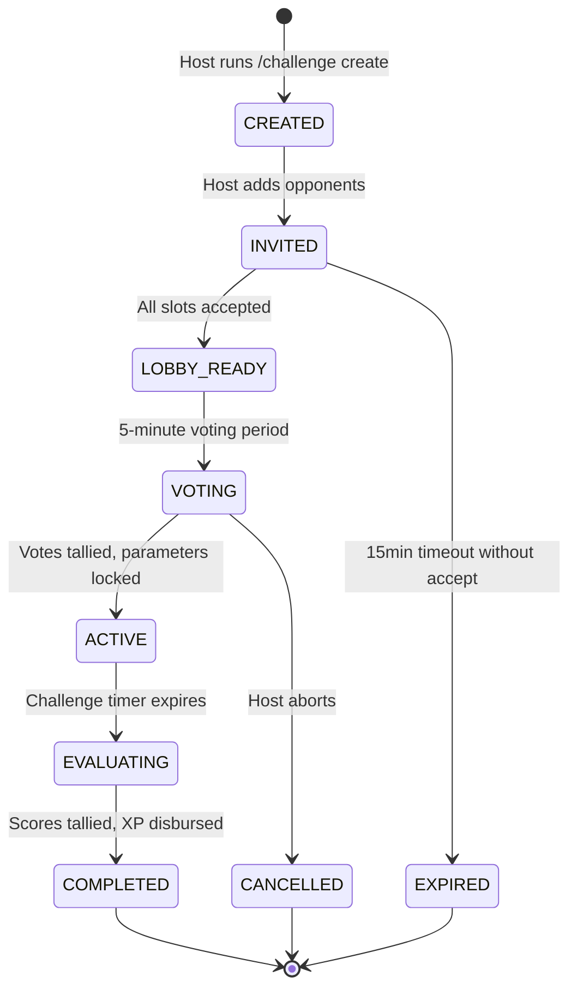

# DevGuild — Challenge Engine Architecture & Scoring Mechanics

## 1. Engine Overview & Philosophy

The DevGuild Challenge Engine coordinates asynchronous competitive matches between members of a Discord server. Challenges can be fought in symmetric formats ($1\text{v}1$, $2\text{v}2$, $3\text{v}3$) or asymmetric formats ($3\text{v}2$, $N\text{v}M$).

### Guiding Principles
- **Natural Solving Flow**: Participants are never given a checklist of static problem IDs to solve. Instead, they solve naturally during the challenge window.
- **Topic Relevance Multipliers**: Submissions matching the voted topic yield enhanced contribution points.
- **Fair Uneven Team Normalization**: Mathematical normalization ensures that a team with fewer members is not overwhelmed by simple headcounts.
- **Zero AFK Toleration**: Users who accept an invitation but fail to produce valid solves receive a reliability penalty.

---

## 2. Challenge Finite State Machine (FSM)

### State Definitions
1. `CREATED`: Initial lobby record instantiated. Team 1 contains host.
2. `INVITED`: Invites dispatched to target Discord IDs via interactive buttons and DMs.
3. `LOBBY_READY`: All player slots confirmed. Host or system triggers the voting countdown.
4. `VOTING`: 5-minute interactive voting period for Topic, Duration, and Intensity.
5. `ACTIVE`: Live competition window. Submissions made during this interval are tracked.
6. `EVALUATING`: Background worker acquires distributed lock, queries submission logs, tallies points, and calculates winners.
7. `COMPLETED`: Victory XP distributed, reliability scores updated, summary embed posted.

---

## 3. Dynamic Voting Engine

During the `VOTING` state, each confirmed player casts one vote for each of three categories:

### 3.1. Topic Categories
- `ARRAYS`
- `STRINGS`
- `TREES`
- `GRAPHS`
- `DYNAMIC_PROGRAMMING`
- `GREEDY`
- `BINARY_SEARCH`
- `BACKTRACKING`
- `MIXED` (Equal weight across all categories)

*Tie-Breaker Rule*: In the event of a tie in topic votes, the host's preference acts as the tie-breaker. If still tied, `MIXED` is automatically selected.

### 3.2. Duration Options
- `24_HOURS` (Default)
- `48_HOURS`
- `72_HOURS`
- `7_DAYS`

*Tie-Breaker Rule*: The median duration value is selected.

### 3.3. Intensity Options
- `CASUAL`: Standard match ($1.0\times$ XP multiplier).
- `COMPETITIVE`: Enhanced stakes ($1.25\times$ XP multiplier, $1.5\times$ reliability impact).
- `HARDCORE`: Maximum intensity ($1.5\times$ XP multiplier, $2.0\times$ reliability impact, only Medium & Hard problems award points).

---

## 4. Mathematical Scoring & Uneven Team Normalization

### 4.1. Individual Problem Contribution Points ($CP_i$)

For every problem $i$ solved by participant $p$ during the active challenge window:

$$CP_i = BasePts(Difficulty) \times W_{topic} \times D(N_{easy}) \times M_{intensity}$$

Where:
- **Base Difficulty Points**:
  $$BasePts(Difficulty) = \begin{cases}
  10 & \text{Easy} \\
  30 & \text{Medium} \\
  75 & \text{Hard}
  \end{cases}$$
- **Topic Relevance Weight ($W_{topic}$)**:
  $$W_{topic} = \begin{cases}
  1.50 & \text{if problem tags match Selected Topic} \\
  1.00 & \text{if Selected Topic is MIXED or non-matching}
  \end{cases}$$
- **Anti-Farming Diminishing Factor ($D(N_{easy})$)**:
  Applied exclusively to Easy problems based on the player's 24-hour easy solve count ($1.0 \to 0.75 \to 0.50 \to 0.25$).
- **Intensity Multiplier ($M_{intensity}$)**:
  $$M_{intensity} = \begin{cases}
  1.00 & \text{CASUAL} \\
  1.25 & \text{COMPETITIVE} \\
  1.50 & \text{HARDCORE (Easy problems award 0 points)}
  \end{cases}$$

### 4.2. Raw Team Score ($S_{raw}$)

$$S_{raw}(T) = \sum_{p \in T} \left( \sum_{i \in Solves(p)} CP_i \right)$$

### 4.3. Uneven Team Size Normalization ($S_{final}$)

If Team 1 has $K_1$ players and Team 2 has $K_2$ players where $K_1 \neq K_2$:
A naive average ($S / K$) penalizes active participation in larger teams, while a raw sum gives an unfair numerical advantage to larger teams. DevGuild implements a **Sub-Linear Elastic Normalization Function**:

$$NormFactor(K) = K^{0.75}$$

$$S_{final}(T) = \frac{S_{raw}(T)}{K^{0.75}} \times \left( \frac{K_1 + K_2}{2} \right)^{0.75}$$

#### Properties of this Formula:
1. When $K_1 = K_2$, the normalization coefficients cancel out, and $S_{final} = S_{raw}$.
2. When $K_1 = 3$ and $K_2 = 2$, Team 1 requires roughly $1.35\times$ the raw points of Team 2 to draw—not $1.5\times$ (pure sum) nor $1.0\times$ (pure average). This rewards collective team effort while preventing pure headcount dominance.

---

## 5. Reliability Updates & AFK Penalties

Upon conclusion:
- **Active Participants (Solves $\ge 1$)**: Reliability $+3.0$ points (capped at $100.0$).
- **Zero-Solve / No-Show Participants**:
  - `CASUAL`: Reliability $-10.0$ points.
  - `COMPETITIVE`: Reliability $-15.0$ points.
  - `HARDCORE`: Reliability $-25.0$ points.
- Users with Reliability $< 60.0$ are blocked from creating or joining `HARDCORE` challenges.

---

## 6. Rewards Distribution

- **Winning Team**: Each member receives $+150$ Guild XP $\times M_{intensity}$.
- **Losing Team**: Each member receives $+50$ Guild XP $\times M_{intensity}$ (participation reward).
- **Match MVP**: The individual player with the highest $CP$ receives an additional $+75$ MVP XP bonus and the "Challenge MVP" ribbon in the recap embed.
