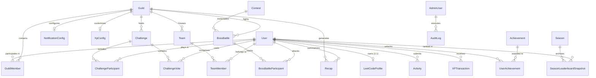

# DevGuild — Database Architecture & Data Dictionary

## 1. Overview & Database Engine Selection

DevGuild utilizes **PostgreSQL 16** as its primary persistent relational data store and **Prisma ORM** for type-safe schema definitions, migrations, and query generation.

### Design Objectives
- **Strict Referential Integrity**: Cascading behaviors, composite unique constraints, and foreign key validations ensure orphaned records cannot exist.
- **Auditability & Immutability**: Critical progression records (such as `XPTransaction`, `Activity`, and `AuditLog`) are treated as append-only ledgers to prevent data tampering.
- **High Read-Throughput Optimization**: Optimized composite B-Tree indexes enable sub-millisecond execution for multi-dimensional leaderboards (weekly, monthly, seasonal, streak, topic, reliability).
- **Concurrency & Idempotency**: Distributed locks alongside row-level locking (`SELECT ... FOR UPDATE`) prevent race conditions during high-concurrency LeetCode sync cycles and challenge evaluation.

---

## 2. Entity-Relationship Model Overview

---

## 3. Comprehensive Data Dictionary

### 3.1. User & Identity Management

#### `User`
The central identity entity mapping a Discord account to the DevGuild ecosystem.
| Column | Type | Nullable | Constraints / Defaults | Description |
|---|---|---|---|---|
| `id` | UUID | No | Primary Key, `gen_random_uuid()` | Internal unique identifier |
| `discordId` | String (VarChar 32) | No | Unique, Indexed | Snowflake ID assigned by Discord |
| `username` | String (VarChar 64) | No | | Discord username / handle |
| `discriminator` | String (VarChar 8) | Yes | | Discord legacy discriminator if present |
| `avatarUrl` | Text | Yes | | Discord CDN avatar URL |
| `reliabilityScore` | Decimal (5,2) | No | Default: 100.00 | Dependability metric bounded between 0.00 and 100.00 |
| `currentStreak` | Integer | No | Default: 0 | Consecutive days with verified problem solves |
| `longestStreak` | Integer | No | Default: 0 | Historical maximum daily solve streak |
| `lastActiveAt` | Timestamp(TZ) | Yes | Indexed | Timestamp of most recent verified solve |
| `createdAt` | Timestamp(TZ) | No | Default: `now()` | Entity creation timestamp |
| `updatedAt` | Timestamp(TZ) | No | Auto-update | Last modification timestamp |

#### `LeetCodeProfile`
Direct 1:1 binding between a Discord user and their official LeetCode profile.
| Column | Type | Nullable | Constraints / Defaults | Description |
|---|---|---|---|---|
| `id` | UUID | No | Primary Key, `gen_random_uuid()` | Profile record identifier |
| `userId` | UUID | No | Unique, Foreign Key (`User.id` ON DELETE CASCADE) | Owner reference |
| `username` | String (VarChar 64) | No | Unique, Indexed | Official LeetCode username |
| `realName` | String (VarChar 128) | Yes | | Name listed on LeetCode public profile |
| `aboutMe` | Text | Yes | | Used for verification token insertion |
| `avatar` | Text | Yes | | LeetCode profile image URL |
| `ranking` | Integer | Yes | | Global LeetCode contest or solve rank |
| `totalSolved` | Integer | No | Default: 0 | Total problems solved according to LeetCode |
| `easySolved` | Integer | No | Default: 0 | Easy problems solved count |
| `mediumSolved`| Integer | No | Default: 0 | Medium problems solved count |
| `hardSolved` | Integer | No | Default: 0 | Hard problems solved count |
| `contestRating`| Decimal (6,2) | Yes | | Official LeetCode contest rating |
| `contestGlobalRank`| Integer | Yes | | Global contest ranking position |
| `isVerified` | Boolean | No | Default: false | True once cryptographic token match succeeds |
| `verificationToken`| String (VarChar 64) | Yes | | Ephemeral challenge token |
| `lastSyncedAt`| Timestamp(TZ) | Yes | Indexed | Last successful GraphQL scrape timestamp |
| `createdAt` | Timestamp(TZ) | No | Default: `now()` | Record creation timestamp |
| `updatedAt` | Timestamp(TZ) | No | Auto-update | Last update timestamp |

---

### 3.2. Guilds, Memberships & Configuration

#### `Guild`
Represents an individual Discord server installation of DevGuild.
| Column | Type | Nullable | Constraints / Defaults | Description |
|---|---|---|---|---|
| `id` | UUID | No | Primary Key, `gen_random_uuid()` | Internal guild identifier |
| `discordGuildId` | String (VarChar 32) | No | Unique, Indexed | Discord Server Snowflake ID |
| `name` | String (VarChar 128)| No | | Discord server name |
| `iconUrl` | Text | Yes | | Discord server icon CDN URL |
| `botJoinedAt` | Timestamp(TZ) | No | Default: `now()` | Date the bot was invited to the server |
| `isActive` | Boolean | No | Default: true | Server installation status |
| `createdAt` | Timestamp(TZ) | No | Default: `now()` | Installation timestamp |
| `updatedAt` | Timestamp(TZ) | No | Auto-update | Modification timestamp |

#### `GuildMember`
Associative table linking Users to Guilds with server-specific progression metrics.
| Column | Type | Nullable | Constraints / Defaults | Description |
|---|---|---|---|---|
| `id` | UUID | No | Primary Key, `gen_random_uuid()` | Membership identifier |
| `guildId` | UUID | No | Foreign Key (`Guild.id` ON DELETE CASCADE) | Guild reference |
| `userId` | UUID | No | Foreign Key (`User.id` ON DELETE CASCADE) | User reference |
| `guildXp` | BigInt | No | Default: 0, Indexed | Server-specific cumulative XP |
| `guildRank` | Enum `RankTier` | No | Default: `BRONZE` | Current calculated rank tier |
| `joinedGuildAt` | Timestamp(TZ) | No | Default: `now()` | Date user joined guild |
| `role` | Enum `GuildRole` | No | Default: `MEMBER` | `MEMBER`, `MODERATOR`, `ADMIN` |
| `isMuted` | Boolean | No | Default: false | Suppress bot alerts for this user |
| `createdAt` | Timestamp(TZ) | No | Default: `now()` | Row creation timestamp |
| `updatedAt` | Timestamp(TZ) | No | Auto-update | Update timestamp |

*Composite Unique Constraint:* `@@unique([guildId, userId])`

#### `XpConfig`
Server-level XP balancing parameters preventing hardcoded formulas.
| Column | Type | Nullable | Constraints / Defaults | Description |
|---|---|---|---|---|
| `id` | UUID | No | Primary Key, `gen_random_uuid()` | Configuration identifier |
| `guildId` | UUID | Yes | Unique, Foreign Key (`Guild.id` ON DELETE CASCADE) | If NULL, serves as global default |
| `baseEasyXp` | Integer | No | Default: 10 | Base XP granted for Easy solve |
| `baseMediumXp`| Integer | No | Default: 30 | Base XP granted for Medium solve |
| `baseHardXp` | Integer | No | Default: 75 | Base XP granted for Hard solve |
| `easyTier1Threshold` | Integer | No | Default: 3 | Threshold for 100% Easy multiplier |
| `easyTier2Threshold` | Integer | No | Default: 6 | Threshold for 75% Easy multiplier |
| `easyTier3Threshold` | Integer | No | Default: 10 | Threshold for 50% Easy multiplier |
| `easyFloorPercent` | Integer | No | Default: 25 | Final diminishing return percentage (25%) |
| `streakBonusRate` | Decimal (4,3) | No | Default: 0.020 | Extra multiplier per consecutive day |
| `streakBonusCap` | Decimal (4,3) | No | Default: 0.500 | Maximum streak multiplier ceiling (+50%) |
| `createdAt` | Timestamp(TZ) | No | Default: `now()` | Row creation timestamp |
| `updatedAt` | Timestamp(TZ) | No | Auto-update | Update timestamp |

#### `NotificationConfig`
Configurable alert subscriptions per Discord guild.
| Column | Type | Nullable | Constraints / Defaults | Description |
|---|---|---|---|---|
| `id` | UUID | No | Primary Key, `gen_random_uuid()` | Record identifier |
| `guildId` | UUID | No | Unique, Foreign Key (`Guild.id` ON DELETE CASCADE) | Guild reference |
| `activityChannelId` | String (VarChar 32) | Yes | | Channel snowflake for solve announcements |
| `recapChannelId` | String (VarChar 32) | Yes | | Channel snowflake for daily/weekly recaps |
| `bossBattleChannelId` | String (VarChar 32) | Yes | | Channel snowflake for contest raid events |
| `challengeChannelId` | String (VarChar 32) | Yes | | Channel snowflake for challenge lobbies |
| `enableActivityAlerts`| Boolean | No | Default: true | Toggle real-time solve announcements |
| `enableDailyRecaps` | Boolean | No | Default: true | Toggle daily recap embed broadcast |
| `enableWeeklyRecaps`| Boolean | No | Default: true | Toggle weekly recap embed broadcast |
| `enableBossAlerts` | Boolean | No | Default: true | Toggle boss battle reminders |
| `enableChallengeAlerts`| Boolean | No | Default: true| Toggle challenge invites and alerts |
| `createdAt` | Timestamp(TZ) | No | Default: `now()` | Row creation timestamp |
| `updatedAt` | Timestamp(TZ) | No | Auto-update | Update timestamp |

---

### 3.3. Activity Tracking & XP Ledger

#### `Activity`
Immutable record of verified LeetCode accepted submissions.
| Column | Type | Nullable | Constraints / Defaults | Description |
|---|---|---|---|---|
| `id` | UUID | No | Primary Key, `gen_random_uuid()` | Unique activity identifier |
| `userId` | UUID | No | Foreign Key (`User.id` ON DELETE CASCADE) | User reference |
| `leetCodeSubmissionId` | String (VarChar 64) | No | Indexed | Submission ID from LeetCode |
| `problemTitle` | String (VarChar 255) | No | | Problem title (e.g., "Two Sum") |
| `problemSlug` | String (VarChar 255) | No | Indexed | URL slug (e.g., "two-sum") |
| `difficulty` | Enum `ProblemDifficulty` | No | | `EASY`, `MEDIUM`, `HARD` |
| `topicTags` | String[] | No | Default: `{}` | Problem topic category tags |
| `primaryTopic` | Enum `TopicCategory` | No | Default: `OTHER` | Normalized topic bucket for scoring |
| `submissionTimestamp` | Timestamp(TZ) | No | Indexed | Official timestamp recorded on LeetCode |
| `runtimeMs` | Integer | Yes | | Submission runtime speed |
| `memoryBytes` | BigInt | Yes | | Submission memory consumption |
| `createdAt` | Timestamp(TZ) | No | Default: `now()` | Ingestion timestamp |

*Composite Unique Constraint:* `@@unique([userId, leetCodeSubmissionId])`
*Indexes:* `@@index([userId, submissionTimestamp])`, `@@index([primaryTopic])`

#### `XPTransaction`
Financial-grade double-entry audit record for every XP adjustment.
| Column | Type | Nullable | Constraints / Defaults | Description |
|---|---|---|---|---|
| `id` | UUID | No | Primary Key, `gen_random_uuid()` | Transaction identifier |
| `userId` | UUID | No | Foreign Key (`User.id` ON DELETE CASCADE) | Recipient user |
| `guildId` | UUID | Yes | Foreign Key (`Guild.id` ON DELETE SET NULL) | Server context (if applicable) |
| `activityId` | UUID | Yes | Foreign Key (`Activity.id` ON DELETE SET NULL) | Source problem solve |
| `challengeId` | UUID | Yes | Foreign Key (`Challenge.id` ON DELETE SET NULL) | Source challenge event |
| `bossBattleId` | UUID | Yes | Foreign Key (`BossBattle.id` ON DELETE SET NULL)| Source boss battle event |
| `source` | Enum `XpSource` | No | | `PROBLEM_SOLVE`, `STREAK_BONUS`, `CHALLENGE_WIN`, `CHALLENGE_PARTICIPATION`, `BOSS_BATTLE`, `ADMIN_ADJUSTMENT`, `SEASON_REWARD` |
| `baseAmount` | Integer | No | | Base XP value before modifiers |
| `multiplier` | Decimal (4,2) | No | Default: 1.00 | Effective combined multiplier |
| `finalAmount` | Integer | No | | Net XP awarded ($Amount = \text{round}(Base \times Multiplier)$) |
| `diminishingRate` | Decimal (4,2) | No | Default: 1.00 | Anti-farming coefficient applied |
| `reason` | String (VarChar 255) | Yes | | Descriptive audit comment |
| `createdAt` | Timestamp(TZ) | No | Default: `now()` | Timestamp of transaction |

---

### 3.4. Challenges & Voting

#### `Challenge`
High-stakes community battle instances.
| Column | Type | Nullable | Constraints / Defaults | Description |
|---|---|---|---|---|
| `id` | UUID | No | Primary Key, `gen_random_uuid()` | Challenge identifier |
| `guildId` | UUID | No | Foreign Key (`Guild.id` ON DELETE CASCADE) | Discord server context |
| `creatorId` | UUID | No | Foreign Key (`User.id` ON DELETE RESTRICT) | Challenging user who hosted the lobby |
| `format` | Enum `ChallengeFormat` | No | | `ONE_V_ONE`, `TWO_V_TWO`, `THREE_V_THREE`, `CUSTOM_TEAMS` |
| `status` | Enum `ChallengeStatus` | No | Default: `CREATED` | `CREATED`, `LOBBY_READY`, `VOTING`, `ACTIVE`, `EVALUATING`, `COMPLETED`, `CANCELLED`, `EXPIRED` |
| `winningTeamNumber` | Integer | Yes | | 1 or 2, or NULL if draw/cancelled |
| `selectedTopic` | Enum `TopicCategory` | Yes | | Topic decided by voting |
| `durationHours` | Integer | No | Default: 24 | Challenge run length (24, 48, 72, 168) |
| `intensity` | Enum `ChallengeIntensity` | No | Default: `CASUAL` | `CASUAL` (1.0x), `COMPETITIVE` (1.25x), `HARDCORE` (1.5x) |
| `votingStartsAt` | Timestamp(TZ) | Yes | | Timestamp voting commenced |
| `votingEndsAt` | Timestamp(TZ) | Yes | | Timestamp voting concluded |
| `startsAt` | Timestamp(TZ) | Yes | Indexed | Actual start timestamp |
| `endsAt` | Timestamp(TZ) | Yes | Indexed | Deadline timestamp |
| `discordMessageId` | String (VarChar 32) | Yes | | Channel message containing the active embed |
| `createdAt` | Timestamp(TZ) | No | Default: `now()` | Lobby creation timestamp |
| `updatedAt` | Timestamp(TZ) | No | Auto-update | Modification timestamp |

#### `ChallengeParticipant`
Player assignment to teams within a challenge.
| Column | Type | Nullable | Constraints / Defaults | Description |
|---|---|---|---|---|
| `id` | UUID | No | Primary Key, `gen_random_uuid()` | Record identifier |
| `challengeId` | UUID | No | Foreign Key (`Challenge.id` ON DELETE CASCADE) | Challenge reference |
| `userId` | UUID | No | Foreign Key (`User.id` ON DELETE CASCADE) | Player reference |
| `teamNumber` | Integer | No | | 1 or 2 |
| `status` | Enum `ParticipantStatus` | No | Default: `INVITED` | `INVITED`, `ACCEPTED`, `DECLINED` |
| `contributionPoints` | Decimal (8,2) | No | Default: 0.00 | Total score points earned during challenge |
| `problemsSolved` | Integer | No | Default: 0 | Number of verified problems solved |
| `isMvp` | Boolean | No | Default: false | Highest individual point earner |
| `createdAt` | Timestamp(TZ) | No | Default: `now()` | Ingestion timestamp |

*Composite Unique Constraint:* `@@unique([challengeId, userId])`

#### `ChallengeVote`
Individual player votes on challenge parameters.
| Column | Type | Nullable | Constraints / Defaults | Description |
|---|---|---|---|---|
| `id` | UUID | No | Primary Key, `gen_random_uuid()` | Vote identifier |
| `challengeId` | UUID | No | Foreign Key (`Challenge.id` ON DELETE CASCADE) | Challenge reference |
| `userId` | UUID | No | Foreign Key (`User.id` ON DELETE CASCADE) | Voter reference |
| `topicVote` | Enum `TopicCategory` | Yes | | Preferred topic |
| `durationVoteHours` | Integer | Yes | | Preferred duration |
| `intensityVote` | Enum `ChallengeIntensity` | Yes | | Preferred intensity |
| `createdAt` | Timestamp(TZ) | No | Default: `now()` | Vote timestamp |

*Composite Unique Constraint:* `@@unique([challengeId, userId])`

---

### 3.5. Teams & Guild Squads

#### `Team`
Permanent user squads within a Discord guild.
| Column | Type | Nullable | Constraints / Defaults | Description |
|---|---|---|---|---|
| `id` | UUID | No | Primary Key, `gen_random_uuid()` | Team identifier |
| `guildId` | UUID | No | Foreign Key (`Guild.id` ON DELETE CASCADE) | Discord server context |
| `leaderId` | UUID | No | Foreign Key (`User.id` ON DELETE RESTRICT) | Squad leader |
| `name` | String (VarChar 64) | No | | Team name (unique per guild) |
| `tag` | String (VarChar 6) | No | | 3-6 char bracketed squad tag, e.g. `[DEV]` |
| `avatarUrl` | Text | Yes | | Custom squad icon URL |
| `totalXp` | BigInt | No | Default: 0, Indexed | Cumulative team XP |
| `wins` | Integer | No | Default: 0 | Challenge victories count |
| `losses` | Integer | No | Default: 0 | Challenge defeats count |
| `reliabilityScore` | Decimal (5,2) | No | Default: 100.00 | Aggregated team dependability |
| `currentStreak` | Integer | No | Default: 0 | Consecutive challenge win streak |
| `createdAt` | Timestamp(TZ) | No | Default: `now()` | Team creation timestamp |
| `updatedAt` | Timestamp(TZ) | No | Auto-update | Modification timestamp |

*Composite Unique Constraint:* `@@unique([guildId, name])`, `@@unique([guildId, tag])`

#### `TeamMember`
| Column | Type | Nullable | Constraints / Defaults | Description |
|---|---|---|---|---|
| `id` | UUID | No | Primary Key, `gen_random_uuid()` | Record identifier |
| `teamId` | UUID | No | Foreign Key (`Team.id` ON DELETE CASCADE) | Team reference |
| `userId` | UUID | No | Foreign Key (`User.id` ON DELETE CASCADE) | Member reference |
| `role` | Enum `TeamRole` | No | Default: `MEMBER` | `LEADER`, `CO_LEADER`, `MEMBER` |
| `joinedAt` | Timestamp(TZ) | No | Default: `now()` | Timestamp joined squad |

*Composite Unique Constraint:* `@@unique([teamId, userId])`

---

### 3.6. Contests & Boss Battles

#### `Contest`
Official LeetCode contests tracked globally.
| Column | Type | Nullable | Constraints / Defaults | Description |
|---|---|---|---|---|
| `id` | UUID | No | Primary Key, `gen_random_uuid()` | Contest identifier |
| `leetCodeContestId` | String (VarChar 64) | No | Unique, Indexed | Official contest slug (e.g., `weekly-contest-418`) |
| `title` | String (VarChar 128) | No | | Display title |
| `type` | Enum `ContestType` | No | | `WEEKLY`, `BIWEEKLY` |
| `startTime` | Timestamp(TZ) | No | Indexed | Official contest start time |
| `endTime` | Timestamp(TZ) | No | Indexed | Official contest end time |
| `isProcessed` | Boolean | No | Default: false | True once final results scraped |
| `createdAt` | Timestamp(TZ) | No | Default: `now()` | Record creation timestamp |

#### `BossBattle`
Server-specific boss battle event mapped from an official contest.
| Column | Type | Nullable | Constraints / Defaults | Description |
|---|---|---|---|---|
| `id` | UUID | No | Primary Key, `gen_random_uuid()` | Boss battle identifier |
| `guildId` | UUID | No | Foreign Key (`Guild.id` ON DELETE CASCADE) | Discord server context |
| `contestId` | UUID | No | Foreign Key (`Contest.id` ON DELETE CASCADE) | Official contest reference |
| `bossType` | Enum `BossType` | No | | `WEEKLY_BOSS`, `MEGA_BOSS` |
| `bossName` | String (VarChar 64) | No | | Lore boss name (e.g., "The Recursion Dragon") |
| `totalHealthPoints` | Integer | No | | Calculated HP target based on guild members |
| `currentHealthPoints`| Integer | No | | Remaining boss HP |
| `isDefeated` | Boolean | No | Default: false | True if raid damage exceeds HP |
| `announcementMessageId`| String (VarChar 32) | Yes | | Message snowflake in boss battle channel |
| `createdAt` | Timestamp(TZ) | No | Default: `now()` | Ingestion timestamp |
| `updatedAt` | Timestamp(TZ) | No | Auto-update | Modification timestamp |

*Composite Unique Constraint:* `@@unique([guildId, contestId])`

#### `BossBattleParticipant`
| Column | Type | Nullable | Constraints / Defaults | Description |
|---|---|---|---|---|
| `id` | UUID | No | Primary Key, `gen_random_uuid()` | Record identifier |
| `bossBattleId` | UUID | No | Foreign Key (`BossBattle.id` ON DELETE CASCADE) | Boss battle reference |
| `userId` | UUID | No | Foreign Key (`User.id` ON DELETE CASCADE) | Attacking user |
| `problemsSolved` | Integer | No | Default: 0 | Number of contest questions solved (0-4) |
| `damageDealt` | Integer | No | Default: 0 | Calculated damage inflicted to boss HP |
| `contestRank` | Integer | Yes | | Global contest rank achieved |
| `xpAwarded` | Integer | No | Default: 0 | Contest XP granted |
| `createdAt` | Timestamp(TZ) | No | Default: `now()` | Record timestamp |

*Composite Unique Constraint:* `@@unique([bossBattleId, userId])`

---

### 3.7. Achievements, Seasons & Recaps

#### `Achievement`
Global catalog of unlockable milestones.
| Column | Type | Nullable | Constraints / Defaults | Description |
|---|---|---|---|---|
| `id` | UUID | No | Primary Key, `gen_random_uuid()` | Achievement identifier |
| `code` | String (VarChar 64) | No | Unique, Indexed | Slug (e.g., `FIRST_SOLVE`, `SEVEN_DAY_STREAK`) |
| `name` | String (VarChar 128) | No | | Display name |
| `description` | Text | No | | Requirement explanation |
| `category` | Enum `AchievementCategory` | No | | `PROGRESSION`, `CONSISTENCY`, `CHALLENGES`, `CONTESTS`, `TOPICS`, `DIFFICULTY` |
| `tier` | Enum `AchievementTier` | No | Default: `BRONZE` | `BRONZE`, `SILVER`, `GOLD`, `PLATINUM` |
| `iconUrl` | Text | Yes | | Badge image asset URL |
| `xpReward` | Integer | No | Default: 50 | One-time bonus XP granted on unlock |
| `criteriaJson` | JSONB | No | | Evaluator rules definition |
| `createdAt` | Timestamp(TZ) | No | Default: `now()` | Creation timestamp |

#### `UserAchievement`
Unlocked achievements per player.
| Column | Type | Nullable | Constraints / Defaults | Description |
|---|---|---|---|---|
| `id` | UUID | No | Primary Key, `gen_random_uuid()` | Record identifier |
| `userId` | UUID | No | Foreign Key (`User.id` ON DELETE CASCADE) | Unlocking user |
| `achievementId` | UUID | No | Foreign Key (`Achievement.id` ON DELETE CASCADE) | Achievement reference |
| `unlockedAt` | Timestamp(TZ) | No | Default: `now()`, Indexed | Unlock timestamp |

*Composite Unique Constraint:* `@@unique([userId, achievementId])`

#### `Season`
90-day competitive cycles.
| Column | Type | Nullable | Constraints / Defaults | Description |
|---|---|---|---|---|
| `id` | UUID | No | Primary Key, `gen_random_uuid()` | Season identifier |
| `number` | Integer | No | Unique, Indexed | Season sequential integer (1, 2, 3...) |
| `name` | String (VarChar 64) | No | | Thematic name (e.g., "Season of the Trees") |
| `startsAt` | Timestamp(TZ) | No | Indexed | Season kickoff timestamp |
| `endsAt` | Timestamp(TZ) | No | Indexed | Season conclusion timestamp |
| `status` | Enum `SeasonStatus` | No | Default: `UPCOMING` | `UPCOMING`, `ACTIVE`, `FROZEN`, `ARCHIVED` |
| `createdAt` | Timestamp(TZ) | No | Default: `now()` | Record creation timestamp |

#### `SeasonLeaderboardSnapshot`
Permanent Hall of Fame records preserved post-reset.
| Column | Type | Nullable | Constraints / Defaults | Description |
|---|---|---|---|---|
| `id` | UUID | No | Primary Key, `gen_random_uuid()` | Snapshot identifier |
| `seasonId` | UUID | No | Foreign Key (`Season.id` ON DELETE CASCADE) | Season reference |
| `guildId` | UUID | No | Foreign Key (`Guild.id` ON DELETE CASCADE) | Discord server context |
| `userId` | UUID | No | Foreign Key (`User.id` ON DELETE CASCADE) | Ranked player |
| `finalRankPosition` | Integer | No | | Leaderboard place (#1, #2, etc.) |
| `finalRankTier` | Enum `RankTier` | No | | Highest rank achieved in season |
| `finalXp` | BigInt | No | | Total seasonal XP scored |
| `totalProblemsSolved`| Integer | No | | Total problems solved during season |
| `challengesWon` | Integer | No | | Total challenge victories |
| `createdAt` | Timestamp(TZ) | No | Default: `now()` | Snapshot creation timestamp |

*Composite Unique Constraint:* `@@unique([seasonId, guildId, userId])`

#### `Recap`
Generated Daily, Weekly, and Monthly Wrapped summaries.
| Column | Type | Nullable | Constraints / Defaults | Description |
|---|---|---|---|---|
| `id` | UUID | No | Primary Key, `gen_random_uuid()` | Recap identifier |
| `guildId` | UUID | Yes | Foreign Key (`Guild.id` ON DELETE CASCADE) | Guild context (if server recap) |
| `userId` | UUID | Yes | Foreign Key (`User.id` ON DELETE CASCADE) | User context (if personal recap) |
| `type` | Enum `RecapType` | No | | `DAILY`, `WEEKLY`, `MONTHLY_WRAPPED` |
| `periodStart` | Timestamp(TZ) | No | Indexed | Start date of summary window |
| `periodEnd` | Timestamp(TZ) | No | Indexed | End date of summary window |
| `metricsJson` | JSONB | No | | Serialized stats (solves, diffs, XP, ranks) |
| `cardImageUrl`| Text | Yes | | S3/CDN or local URL of rendered PNG card |
| `createdAt` | Timestamp(TZ) | No | Default: `now()` | Generation timestamp |

---

### 3.8. Security & Administration

#### `AdminUser`
Web dashboard operator accounts.
| Column | Type | Nullable | Constraints / Defaults | Description |
|---|---|---|---|---|
| `id` | UUID | No | Primary Key, `gen_random_uuid()` | Admin identifier |
| `discordId` | String (VarChar 32) | No | Unique, Indexed | Discord Snowflake |
| `username` | String (VarChar 64) | No | | Username |
| `role` | Enum `AdminRole` | No | Default: `GUILD_ADMIN` | `SUPER_ADMIN`, `GUILD_ADMIN`, `MODERATOR` |
| `isActive` | Boolean | No | Default: true | Enabled status |
| `createdAt` | Timestamp(TZ) | No | Default: `now()` | Ingestion timestamp |
| `updatedAt` | Timestamp(TZ) | No | Auto-update | Modification timestamp |

#### `AuditLog`
Immutable administrative change tracking.
| Column | Type | Nullable | Constraints / Defaults | Description |
|---|---|---|---|---|
| `id` | UUID | No | Primary Key, `gen_random_uuid()` | Audit identifier |
| `adminUserId`| UUID | No | Foreign Key (`AdminUser.id` ON DELETE RESTRICT) | Acting admin |
| `action` | String (VarChar 128) | No | Indexed | Action slug (e.g., `XP_BALANCE_UPDATE`) |
| `targetEntity`| String (VarChar 64) | No | | Entity modified (`XpConfig`, `User`, `Guild`) |
| `targetId` | String (VarChar 64) | Yes | | Primary key of modified entity |
| `beforeState`| JSONB | Yes | | State prior to modification |
| `afterState` | JSONB | Yes | | State post modification |
| `ipAddress` | String (VarChar 45) | Yes | | IPv4/IPv6 address of request |
| `createdAt` | Timestamp(TZ) | No | Default: `now()`, Indexed | Action timestamp |

---

## 4. Indexing & Partitioning Strategy

1. **High-Frequency Composite Indexes**:
   - `GuildMember(guildId, guildXp DESC)`: Used for zero-cost Leaderboard rankings.
   - `Activity(userId, submissionTimestamp DESC)`: Accelerated lookup for daily solve counts and anti-farming calculation.
   - `XPTransaction(userId, createdAt DESC)`: Sub-millisecond transaction statement queries.
   - `Challenge(guildId, status, startsAt)`: Instant active challenge lookups for Discord schedule announcements.

2. **Partitioning Plan (Scale Phase)**:
   - For communities with hundreds of thousands of daily submissions, `Activity` and `XPTransaction` tables utilize PostgreSQL declarative range partitioning on `submissionTimestamp` and `createdAt` partitioned by month (`PARTITION BY RANGE (submissionTimestamp)`).
