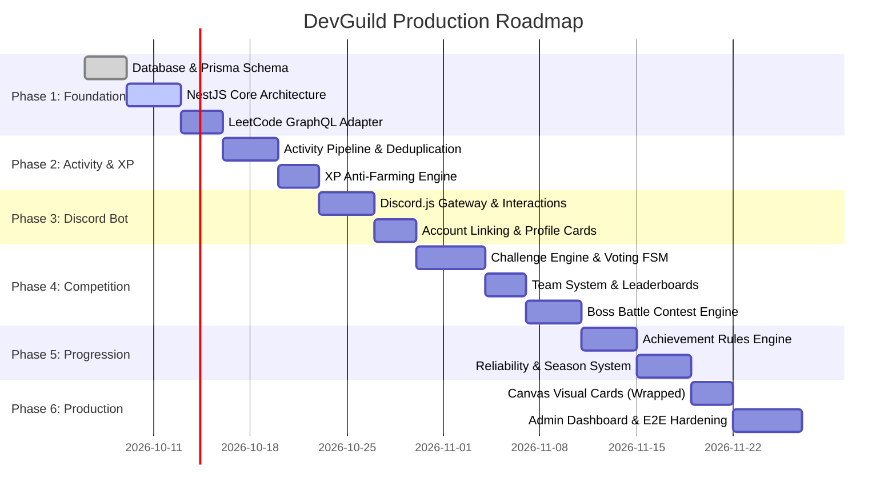

# DevGuild — Comprehensive Implementation Roadmap

## 1. Roadmap Overview & Timeline

The DevGuild implementation roadmap is structured into 6 sequential, milestone-gated engineering phases designed for high velocity, mathematical rigor, and zero-downtime production deployment.

---

## 2. Phase-by-Phase Breakdown & Deliverables

### Phase 1: Foundation & Data Layer
- **Goal**: Establish the core runtime, database schemas, BullMQ queue topology, and LeetCode API integration.
- **Key Deliverables**:
  - PostgreSQL 16 schema initialized via Prisma migrations.
  - Redis 7 cluster configuration with Redlock distributed locking setup.
  - NestJS modular monolith framework (`ConfigModule`, `PrismaModule`, `RedisModule`).
  - Resilient LeetCode GraphQL Client featuring rate-limit mitigation and bio-token verification.
- **Verification Gate**:
  - `prisma validate` passes with zero schema errors.
  - Unit tests prove GraphQL query parsing and token extraction.

### Phase 2: Activity Tracking & Anti-Farming XP Engine
- **Goal**: Implement background polling, submission deduplication, and mathematical XP attribution.
- **Key Deliverables**:
  - `leetcode-sync-queue` workers processing user submission streams.
  - Problem classification and primary topic categorization.
  - Diminishing returns curve logic ($100\% \to 75\% \to 50\% \to 25\%$) for Easy problems.
  - Double-entry `XPTransaction` ledger with streak bonus calculation.
- **Verification Gate**:
  - Unit tests verify diminishing returns thresholds across 15 simulated daily solves.
  - Concurrency tests confirm that duplicate submissions yield exactly 1 `Activity` record.

### Phase 3: Discord Bot Core & User Commands
- **Goal**: Deliver the interactive Discord Gateway client and core slash commands.
- **Key Deliverables**:
  - Discord.js v14 client initialization with command autoloading.
  - Slash commands: `/link`, `/unlink`, `/profile`, `/leaderboard`.
  - Ephemeral verification prompt with one-click "Verify Now" interactive button.
  - Dynamic embeds styled according to rank color tokens.
- **Verification Gate**:
  - Slash command registration via Discord REST API.
  - Automated interaction tests for button callbacks and deferrals.

### Phase 4: Competitive Systems (Challenges, Teams & Boss Battles)
- **Goal**: Build the flagship guild competition features.
- **Key Deliverables**:
  - Challenge Finite State Machine (`CREATED` $\to$ `ACTIVE` $\to$ `COMPLETED`).
  - 5-minute interactive voting phase for Topic, Duration, and Intensity.
  - Sub-linear elastic scoring formula normalizing uneven teams ($3\text{v}2$, $N\text{v}M$).
  - Official LeetCode Contest scraper translating contests into Guild Boss Battles.
- **Verification Gate**:
  - Unit test proving mathematical fairness of uneven team normalization.
  - Mock contest scraper test simulating boss HP depletion and MVP calculation.

### Phase 5: Progression, Reliability & 90-Day Seasons
- **Goal**: Implement long-term accountability, streak preservation, and seasonal resets.
- **Key Deliverables**:
  - Event-driven Achievement Engine evaluating dynamic `criteriaJson` rules.
  - Reliability scoring algorithm penalizing AFK challenge participants.
  - 90-day season lifecycle with soft MMR reset formula and Hall of Fame snapshot generation.
- **Verification Gate**:
  - Achievement evaluator tests triggering unlock on threshold events.
  - Soft reset test confirming MMR compression across all 7 rank tiers.

### Phase 6: Recaps, Visual Cards, Admin & Production Hardening
- **Goal**: Build shareable social proof cards, web administrative dashboard, and deployment assets.
- **Key Deliverables**:
  - `@napi-rs/canvas` renderer for Monthly Wrapped and Leaderboard share cards.
  - Daily and Weekly automated recap broadcasts via BullMQ crons.
  - Web Admin REST API with audit logging and XP configuration endpoints.
  - Docker multi-stage images, Docker Compose stack, Prometheus metrics, and deployment documentation.
- **Verification Gate**:
  - E2E tests for end-to-end user journey: `/link` $\to$ solve $\to$ XP $\to$ challenge $\to$ season snapshot.
  - Stress test worker concurrency under simulated 500-submission bursts.
