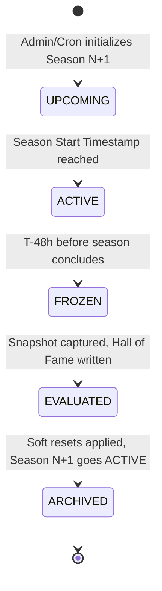

# DevGuild — Season System & Rank Progression Architecture

## 1. Seasonal Vision & Lifecycle

To prevent long-term player stagnation and ensure new community members can compete meaningfully with multi-year veterans, DevGuild organizes competition into **90-Day Competitive Seasons**.

### Core Tenets
- **Fresh Competition Every Quarter**: Leaderboards reset every 90 days.
- **Permanent Prestige**: Lifetime achievements, historical trophies, and Hall of Fame snapshots remain permanently attached to the user profile.
- **Soft Rank Reset**: Rather than resetting all players to Bronze, DevGuild uses a weighted MMR compression formula so skilled veterans maintain an earned head start without dominating new players indefinitely.

---

## 2. Season Lifecycle State Machine

### Phase Details
1. **`UPCOMING`**: Configured 14 days in advance. Users receive countdown notices in `/season` command outputs.
2. **`ACTIVE`**: The 90-day competitive window. All solved problems, challenges, and contests award seasonal XP.
3. **`FROZEN`**: 48 hours prior to the season boundary, leaderboards "freeze". Solves still count toward individual progression, but rank positions are locked to prevent last-minute exploit rushes.
4. **`EVALUATED`**: Background workers generate `SeasonLeaderboardSnapshot` records for top guild performers and archive final standings.
5. **`ARCHIVED`**: Historical data is marked read-only, soft reset is calculated, and Season $N+1$ automatically begins.

---

## 3. Rank Tiers & Seasonal Progression

DevGuild establishes 7 rank tiers based on effective Seasonal MMR:

| Tier | MMR Range | Badge Color | Demotion Protection |
|---|---|---|---|
| **Bronze** | $0 - 499$ | `#CD7F32` | No |
| **Silver** | $500 - 1,199$ | `#C0C0C0` | Yes (Once unlocked, cannot drop to Bronze) |
| **Gold** | $1,200 - 2,499$ | `#FFD700` | Yes |
| **Platinum** | $2,500 - 4,499$ | `#00E5FF` | Yes |
| **Diamond** | $4,500 - 7,499$ | `#3D5AFE` | Tier Decay Enabled (Inactive $>14$ days) |
| **Master** | $7,500 - 11,999$| `#9C27B0` | Tier Decay Enabled (Inactive $>7$ days) |
| **Grandmaster** | $12,000+$ | `#FF1744` | Dynamic Top 1% of Active Guild Solvers |

---

## 4. Soft Reset MMR Compression Formula

At the boundary of Season $S$ and Season $S+1$, user MMR is compressed using a mean-reverting formula:

$$MMR_{new} = BaseOffset + \left( MMR_{old} - BaseOffset \right) \times CompressionFactor$$

Where:
- $BaseOffset = 500$ (Silver Floor baseline)
- $CompressionFactor = 0.35$

### Mapping Example:

| Final Season $S$ Rank | Final $MMR_{old}$ | Calculation | Starting Season $S+1$ Rank |
|---|---|---|---|
| **Bronze** | $300$ | $500 + (300 - 500) \times 0.35 = 430$ | **Bronze** ($430$) |
| **Gold** | $1,800$ | $500 + (1,800 - 500) \times 0.35 = 955$ | **Silver** ($955$) |
| **Diamond** | $5,000$ | $500 + (5,000 - 500) \times 0.35 = 2,075$| **Gold** ($2,075$) |
| **Grandmaster** | $12,000$| $500 + (12,000 - 500) \times 0.35 = 4,525$| **Platinum** ($4,525$) |

### Benefits:
- High performers start in Gold/Platinum rather than grinding through novice problems.
- Eliminates beginner intimidation at the start of a new season.
- Prevents infinite XP inflation.

---

## 5. Hall of Fame & Permanent Artifacts

When a season concludes, the `SeasonTransitionWorker` executes the following atomic transactions:

1. **Snapshot Generation**:
   Captures the top 100 players in each Discord guild and inserts rows into `SeasonLeaderboardSnapshot`.
2. **Trophy Assignment**:
   - `Season Champion` (Rank 1): Awarded gold profile trophy badge.
   - `Podium Finisher` (Ranks 2-3): Awarded silver profile trophy badge.
   - `Top 10 Finisher`: Awarded bronze profile trophy badge.
3. **Discord Trophy Announcement**:
   Posts a high-impact season finale recap embed with top performers, collective guild problems solved, and total Boss Battle HP slain.
4. **MMR Update**:
   Resets `GuildMember.guildXp` to $MMR_{new}$.
